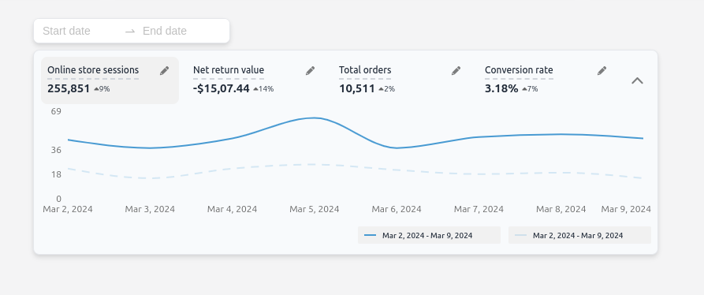
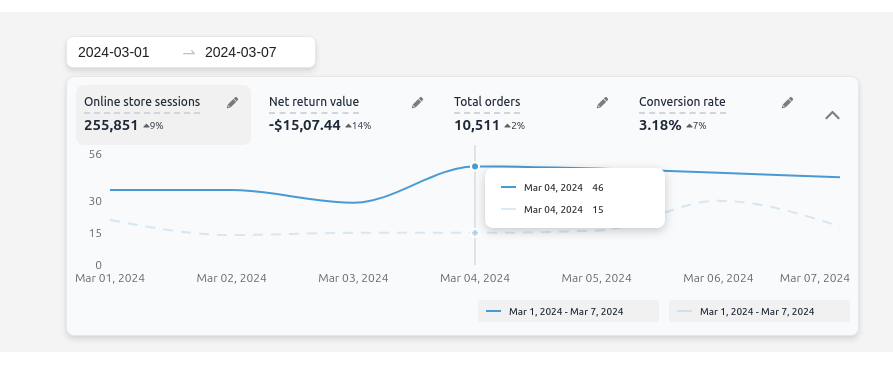

## Approach and Implementation

By making use of RangePicker component provided by the Ant Design library implemented dateRange picker to filter out the response based on selected daterange.

Recharts was utilized for graphical representation, Additionally, it facilitated the implementation of interactive features like tooltips, allowing users to view detailed information when hovering over data points.

The antd Popover component was used to view the title and description of the tab by hovering over the title and edit icon.

Usage of DaisyUI and TailwindCSS

This feature is built using TailwindCSS-based component templates provided by DaisyUI. DaisyUI offers a library of component templates that utilize shorter, semantic class names derived from standard TailwindCSS classes. These classes also include responsive, color, size, and shape variants, enhancing the ease of styling markup elements and improving the clarity of React code.

Additionally, DaisyUI allows for the overriding and extension of its classes, providing flexibility in styling. Furthermore, it supports the usage of regular TailwindCSS classes alongside its templates.


Usage To utilize this feature:

1.Ensure you have the necessary dependencies installed, including React, Ant Design, TailwindCSS, and DaisyUI.
2.Incorporate the provided components and templates into your React application.
3.Customize and extend the styles using DaisyUI's semantic class names and TailwindCSS classes as needed.
4.Integrate the performance overview dashboard into your application, allowing users to analyze key metrics within specified date ranges.

## Code Re-usability

Implemented a single component to display the "from" and "to" dates along with the wave colors, which are utilized at the bottom of the graph and in the graph tooltip. The tab data is rendered through an array of objects, eliminating the need to rewrite redundant code multiple times. Reduced unnecessary API calls, optimizing code efficiency through this approach.

## Quick Start

Run the following command to download the project:

```
npm create refine-app@latest -- --example MarbleAI-Assignment
```

Once the setup is complete, navigate to the project folder and install node module with:

```
npm install
```

start the project with:

```
npm run dev
```

Application will be accessible at http://localhost:5173






### Resources

Tailwind [tailwind docs](https://tailwindcss.com/docs/installation) for responsive design.

Antd [antd](https://ant.design/components) library for dateRangePicker and popover.