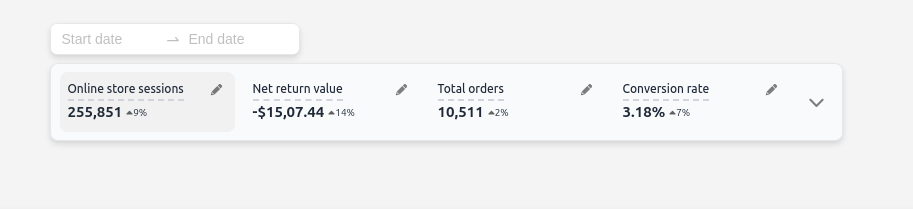
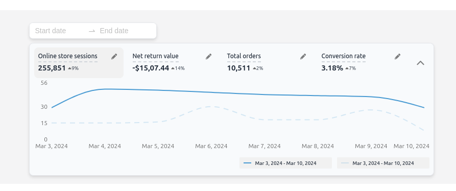

## About

This feature provides a graphical representation of various performance factors for an online store. These factors include:

1.Online store sessions
2.Return values
3.Total orders
4.Conversion rate
Users can analyze the performance within a specified date range selected using the RangePicker component from the Ant Design library.

About DaisyUI and TailwindCSS

This feature is built using TailwindCSS-based component templates provided by DaisyUI. DaisyUI offers a library of component templates that utilize shorter, semantic class names derived from standard TailwindCSS classes. These classes also include responsive, color, size, and shape variants, enhancing the ease of styling markup elements and improving the clarity of React code.

Additionally, DaisyUI allows for the overriding and extension of its classes, providing flexibility in styling. Furthermore, it supports the usage of regular TailwindCSS classes alongside its templates.

Usage

To utilize this feature:

1.Ensure you have the necessary dependencies installed, including React, Ant Design, TailwindCSS, and DaisyUI.
2.Incorporate the provided components and templates into your React application.
3.Customize and extend the styles using DaisyUI's semantic class names and TailwindCSS classes as needed.
4.Integrate the performance overview dashboard into your application, allowing users to analyze key metrics within specified date ranges.

## Quick Start

Run the following command to download the project:

```
npm create refine-app@latest -- --example MarbleAI-Assignment
```

Once the setup is complete, navigate to the project folder and install node module with:

```
npm install
```

start the project with:

```
npm run dev
```

Application will be accessible at http://localhost:5173






### Resources

Tailwind [tailwind docs](https://tailwindcss.com/docs/installation) for responsive design.

Antd [antd](https://ant.design/components) library for dateRangePicker and popover.